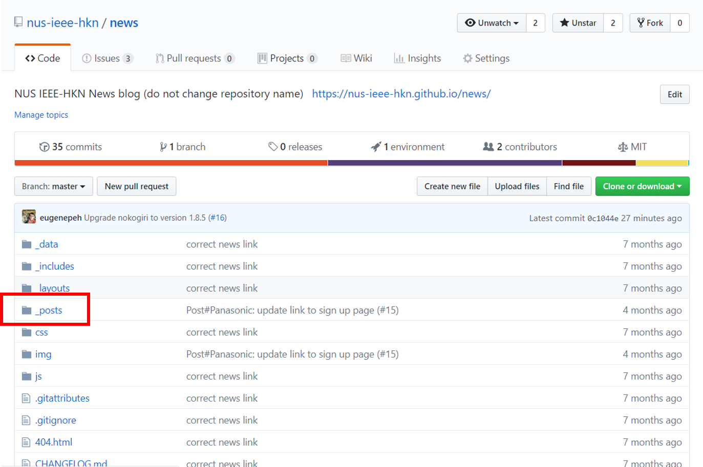
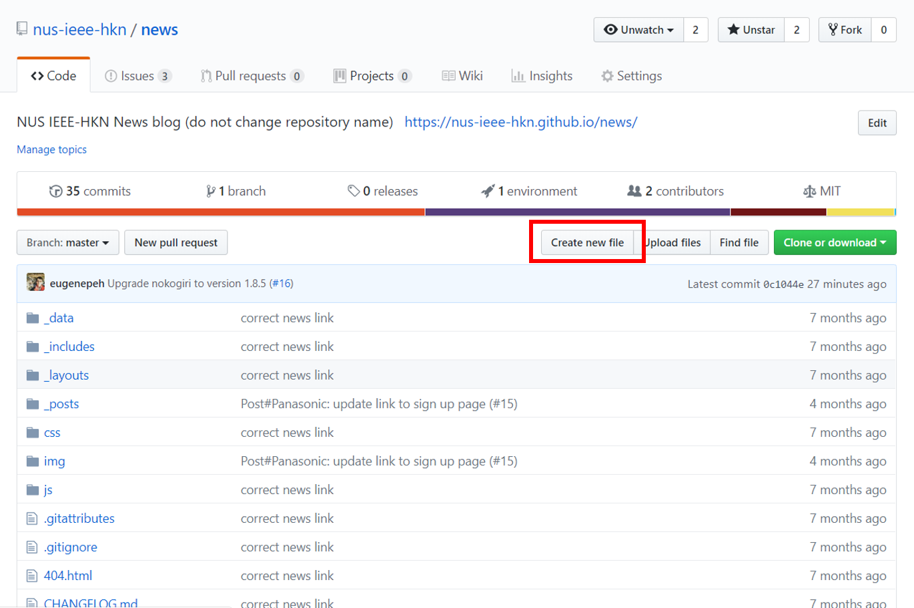
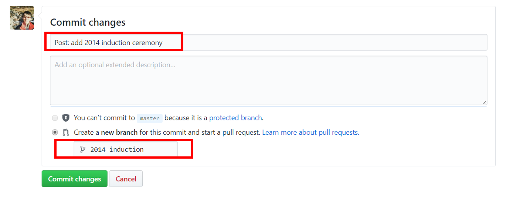
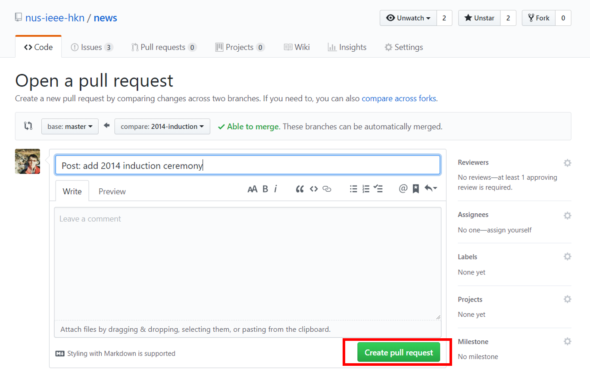

# NUS IEEE HKN NEWS BLOG

## Beginner guide to adding a new post
To create a new post, you will need to create a new file in the `_posts` folder.


To do so, click `Create new file` at the [landing page](https://github.com/nus-ieee-hkn/news).


Note that you will have to follow the file name format `YYYY-MM-DD-TITLE.md` when creating the file.


To place the file in the `_posts` folder, simply key in the name as `_posts/YYYY-MM-DD-TITLE.md`.


The post content has to follow the layout below:
```
---
layout: post
title: Induction Ceremony 2014
tags: [induction, ceremony]
---
The IEEE- Eta Kappa Nu (HKN) Lambda Omega Chapter of NUS Electrical and Computer Engineering (ECE) Department had
completed yet another successful and fruitful induction ceremony for the second batch of students of fine calibre.

On the 8th March 2014, a formal induction ceremony was held to welcome the new inductees into the chapter. The ceremony
was graced by the Head of ECE Department, Professor Chua Kee Chaing. Professor Lawrence Wong, Associate Professor Aaron
Danner and Associate Professor Prahlad Vadakkepat have expressed their strong support and extended the much coveted
expertise and advice in ensuring that operations within the Chapter proceed smoothly. Existing charter members were
tasked with the role of ensuring that the event will be held in accordance with the induction  ritual expected of this
significant milestone.

<div style="text-align:center; font-size: 12px">
    
    New members to be inducted into the Lambda Omega Chapter of NUS
</div>

The three important qualities expected of members in this student honour society include Scholarship, Character and
Attitude. They are expected to play an active role in extending their help and technical knowledge to further promote
the interests of the community, organization and society.

With the induction of new members into the chapter, the Chapter will further consolidate and increase awareness among
the community. Members can work together to promote mutual learning from one another in order to acquire skills and
knowledge which will be instrumental in the strive towards success in future endeavours.

The continual push to propagate the ideals of the Chapter via close interactions will propel the Chapter to greater
heights with a strong mandate given by the ECE Department in recognition of the various achievements manifested by
members of the chapter.

<div style="text-align:center; font-size: 12px">
    
    Group photo of Faculty Academic Staff and Members of the Lambda Omega Chapter. (Front Row (third from right) Associate
Professor Aaron Danner; (fourth from right) Professor Chua Kee Chaing; (left most) Professor Lawrence Wong; (third from
left) Associate Professor Prahlad Vadakkepat)
</div>
```
It must contains the following header in the beginning as shown above:
```
---
layout: post
title: Induction Ceremony 2014
tags: [induction, ceremony]
---
```
where `layout` must be `post` and `tags` in lower case. <br/>
The content uses [Markdown Format](https://www.markdownguide.org/basic-syntax/) but can also include html elements. <br/>

When you're done drafting your post, scroll to the bottom and commit your changes. <br/>
Do use the format `Post: ...` in the title, create a new branch with a meaningful name, and click `Commit changes`.


After clicking the `Commit changes`, go back to [landing page](https://github.com/nus-ieee-hkn/news) again to start the pull request. 


Do notify this repository administrator or HKN IT group when you're done so that they can add your changes to the website!
If you're still unsure any of the steps mentioned above, do approach the IT group for clarification.

## Credits
This is a website that uses the template forked and refractored from the repository, [beautiful-jekyll](https://github.com/daattali/beautiful-jekyll).
